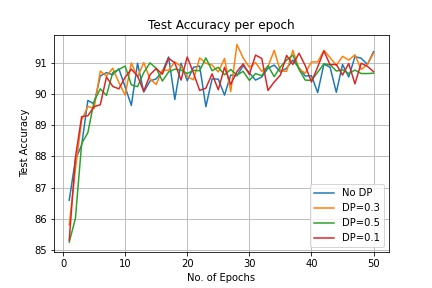
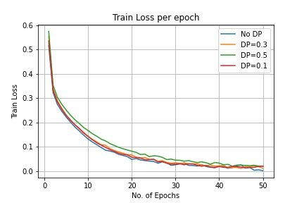

# Fashion_MNIST_classification

This repo is made for classifying the Fashion MNIST dataset using deep learning and the Pytorch Library.

You can find the code at [Fashion_MNIST_classification](https://github.com/valerich95/Fashion_MNIST_classification/blob/main/Fashion_MNIST%20(5).ipynb)

Several Dropout values, learning rates, and activation functions have been tested:

 
  
